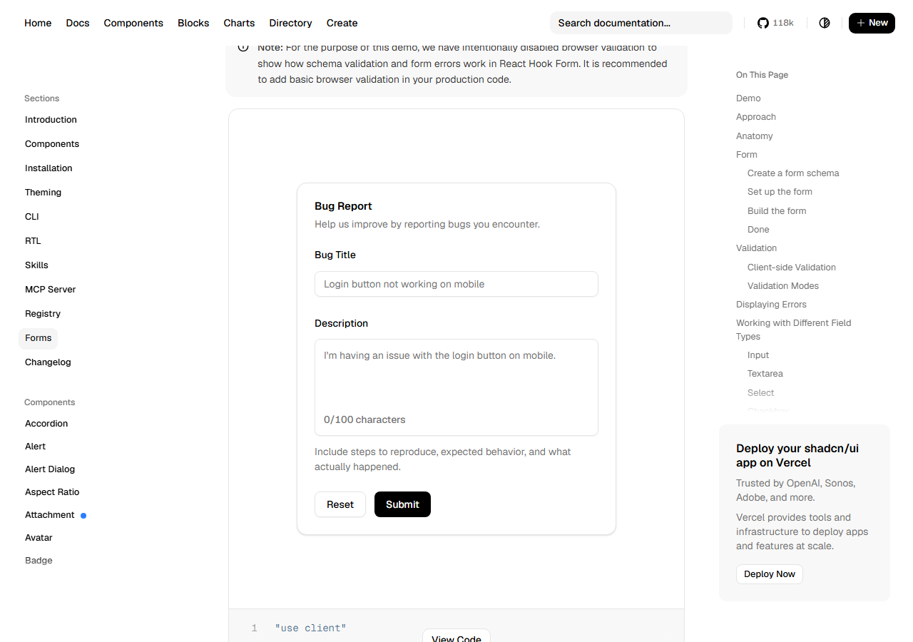
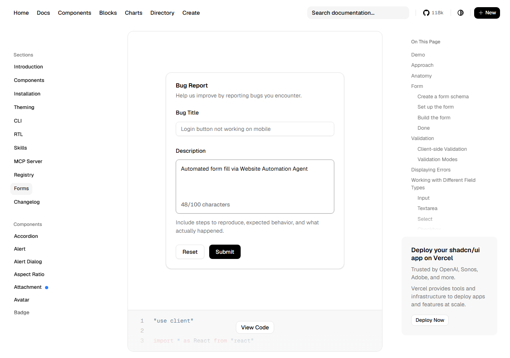
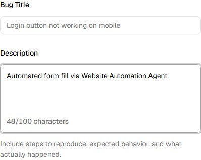
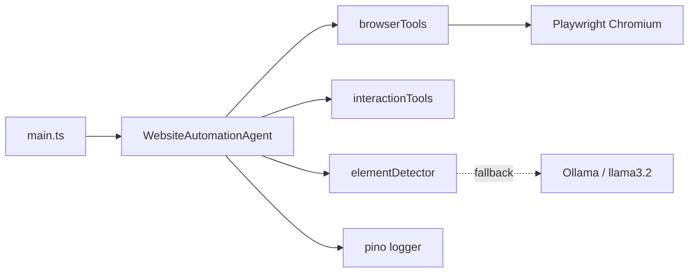

<div align="center">

# Webmaton

**Assignment 04 — Website Automation Agent**

Autonomous browser agent that navigates pages, detects form fields with Playwright + local Ollama, fills them, and captures proof-of-work screenshots.

<br/>

[](https://www.typescriptlang.org/)
[](https://playwright.dev/)
[](https://ollama.com/)
[](https://nodejs.org/)
[](LICENSE)

[Quick Start](#-quick-start) · [Demo](#-demo) · [Architecture](#-architecture) · [Configuration](#%EF%B8%8F-configuration) · [Docs](./ARCHITECTURE.md)

</div>

---

## Overview

Webmaton is a modular **Website Automation Agent** built for a college assignment. It combines deterministic Playwright selectors with a **local Ollama LLM** (`llama3.2`) as a fallback when DOM structure is ambiguous.

| Capability | How it works |
|------------|--------------|
| Navigate | Opens Chromium and loads the target shadcn/ui docs page |
| Detect | Label → role → placeholder → XPath, then LLM selector fallback |
| Fill | Types configurable Name & Description values |
| Prove | Saves timestamped screenshots + structured pino logs |

**Target page:** [shadcn/ui — React Hook Form](https://ui.shadcn.com/docs/forms/react-hook-form)

---

## Demo

### Before → After

<table>
  <tr>
    <td align="center"><strong>1. Page loaded</strong><br/><sub>Form detected, fields empty</sub></td>
    <td align="center"><strong>2. Form filled</strong><br/><sub>Name & Description populated</sub></td>
  </tr>
  <tr>
    <td></td>
    <td></td>
  </tr>
</table>

### Form detail



> Runtime screenshots from a successful agent run. Re-generate anytime with `npm run capture:assets`.

### Sample terminal output

```text
--- Run Summary ---
Success:       YES
Name filled:   YES
Description:   YES
Duration:      ~23s
Target URL:    https://ui.shadcn.com/docs/forms/react-hook-form
Screenshot:    screenshots/form-filled-<timestamp>.png

Steps: llm_plan_generated → browser_opened → navigated_to_url →
       name_field_detected:label:name → name_field_filled →
       description_field_detected:label:description →
       description_field_filled → screenshot_taken → browser_closed
```

---

## Quick Start

### Prerequisites

| Tool | Install |
|------|---------|
| **Node.js 18+** | [nodejs.org](https://nodejs.org) |
| **Ollama** | [ollama.com](https://ollama.com) → then `ollama pull llama3.2` |
| **Playwright** | Auto-installed via `npm install` (`postinstall` hook) |

### Install & run

```bash
git clone https://github.com/NUll-O7/Webmaton.git
cd Webmaton

cp .env.example .env
npm install
npm run build
npm start
```

**Dev mode** (no build step):

```bash
npm run dev
```

**Watch the browser** — set in `.env`:

```env
HEADLESS=false
```

---

## Architecture



<details>
<summary><strong>Project structure</strong></summary>

<br/>

```
src/
├── main.ts                          # CLI entrypoint
├── config.ts                        # Environment configuration
├── types/index.ts                   # Shared TypeScript types
├── utils/logger.ts                  # pino logger setup
├── llm/llmClient.ts                 # Ollama HTTP client
├── tools/
│   ├── browserTools.ts              # openBrowser, navigate, scroll, screenshot
│   └── interactionTools.ts          # click, doubleClick, sendKeys
├── detection/elementDetector.ts     # Deterministic + LLM field detection
└── agent/WebsiteAutomationAgent.ts  # Orchestrator
```

Full module breakdown → [ARCHITECTURE.md](./ARCHITECTURE.md)

</details>

---

## Tooling

Composable browser tools used by the agent:

| Tool | Module | Description |
|------|--------|-------------|
| `openBrowser` | `browserTools` | Launch Chromium |
| `navigateToUrl` | `browserTools` | Navigate with timeout handling |
| `scroll` | `browserTools` | Reveal off-screen elements |
| `takeScreenshot` | `browserTools` | Capture page state to PNG |
| `clickOnScreen` | `interactionTools` | Click at `(x, y)` coordinates |
| `doubleClick` | `interactionTools` | Double-click at coordinates |
| `sendKeys` | `interactionTools` | Fill text into detected fields |

---

## ⚙️ Configuration

Copy `.env.example` → `.env`:

| Variable | Default | Description |
|----------|---------|-------------|
| `HEADLESS` | `true` | Headless browser (`false` to watch) |
| `BROWSER_TIMEOUT_MS` | `30000` | Page / action timeout (ms) |
| `TARGET_URL` | shadcn docs URL | Page to automate |
| `FORM_NAME_VALUE` | `John Doe` | Value for the Name field |
| `FORM_DESCRIPTION_VALUE` | *(see `.env.example`)* | Value for Description |
| `SCREENSHOT_DIR` | `screenshots` | Runtime screenshot output |
| `LOG_LEVEL` | `info` | pino log level |
| `OLLAMA_BASE_URL` | `http://localhost:11434` | Ollama API base URL |
| `LLM_MODEL` | `llama3.2` | Ollama model name |
| `LLM_ENABLED` | `true` | Enable LLM planning + detection fallback |

---

## Scripts

| Command | Description |
|---------|-------------|
| `npm run build` | Compile TypeScript → `dist/` |
| `npm start` | Run compiled agent |
| `npm run dev` | Run via `tsx` (no build) |
| `npm run capture:assets` | Regenerate README demo screenshots |

---

## Troubleshooting

| Issue | Fix |
|-------|-----|
| `Ollama connection refused` | Run `ollama serve` |
| `Model not found` | Run `ollama pull llama3.2` |
| Element not detected | Set `HEADLESS=false`, check logs for strategy used |
| Playwright browser missing | `npx playwright install chromium` |

---

## Tech Stack

TypeScript · Node.js 18+ · Playwright · Ollama (`llama3.2`) · dotenv · pino

---

<div align="center">

**Assignment 04 — Website Automation Agent**

MIT License · Built with Playwright & Ollama

</div>
